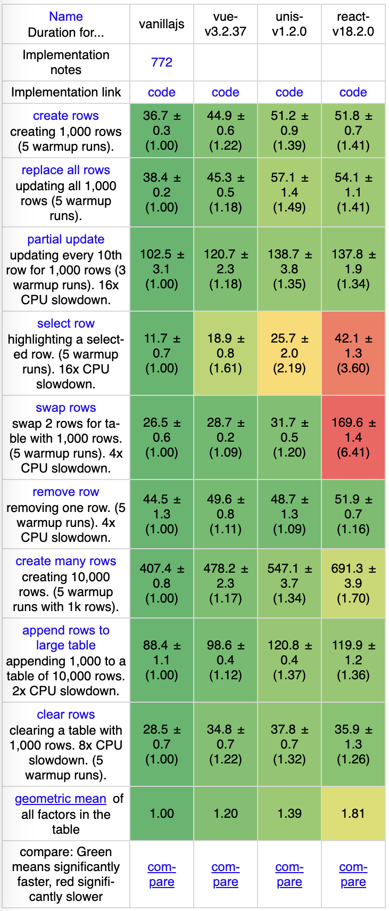

<p align="center">
  
</p>

[](https://github.com/anuoua/unis/actions/workflows/unis-core.yml) [](https://github.com/anuoua/unis/actions/workflows/unis-dom.yml) [](https://github.com/anuoua/unis/actions/workflows/unis-router.yml) [](https://github.com/anuoua/unis/actions/workflows/unis-transition.yml) [](https://github.com/anuoua/unis/actions/workflows/unis-vite-preset.yml) [](https://github.com/anuoua/unis/actions/workflows/unis-babel-preset.yml)

# Unis [中文](./README-zh_CN.md)

Unis is a new front-end framework. Its innovative compilation strategy and component API built help you create web UI more easily.

## Performance



## Installation

```bash
npm i @unis/core @unis/dom
```

## Vite Development

```shell
npm i vite @unis/vite-preset -D
```

vite.config.js

```javascript
import { defineConfig } from "vite";
import { unisPreset } from "@unis/vite-preset";

export default defineConfig({
  plugins: [unisPreset()],
});
```

tsconfig.json

```json
{
  "compilerOptions": {
    "jsx": "react-jsx",
    "jsxImportSource": "@unis/core"
  }
}
```

index.html

```javascript
<html>
  ...
  <body>
    <div id="root"></div>
    <script type="module" src="./index.tsx"></script>
  </body>
</html>
```

index.tsx

```javascript
function App() {
  return () => <div>hello</div>;
}

render(<App />, document.querySelector("#root"));
```

## Usage

Unis is not a replica of React, but a brand new framework that retains the user experience of React. Unis is easy to use, and those who are familiar with React can quickly get started.

### Components

In Unis, the component is a higher-order function.

```javascript
import { render } from "@unis/dom";

const App = () => {
  return () => (
    // Returns a function
    <div>hello world</div>
  );
};

render(<App />, document.querySelector("#root"));
```

### Component State

The usage of `useState` in Unis is similar to React, but it should be noted that for the `use` method series in Unis, the defined type must be `let`. This is because Unis uses the Callback Reassign compilation strategy, and [@callback-reassign/rollup-plugin](https://github.com/anuoua/callback-reassign) helps us complete the Callback Reassign code.

```javascript
import { useState } from "@unis/core";

const App = () => {
  let [msg, setMsg] = useState("hello");
  /**
   * Compile to:
   *
   * let [msg, setMsg] = useState('hello', ([$0, $1]) => { msg = $0; setMsg = $1 });
   */
  return () => <div>{msg}</div>;
};
```

### Props

Directly using `props` in Unis will be unable to get the latest value, so Unis provides `useProps`.

```javascript
import { useProps } from "@unis/core";

const App = (p) => {
  let { some } = useProps(p);
  /**
   * Compile to:
   *
   * let { some } = useProps(p, ({ some: $0 }) => { some = $0 });
   */
  return () => <div>{some}</div>;
};
```

### Side Effects

Unis retains the familiar `useEffect` and `useLayoutEffect` methods from React, but the `deps` parameter is a function that returns an array.

```javascript
import { useEffect } from "@unis/core";

const App = () => {
  useEffect(
    () => {
      // ...
      return () => {
        // Clean up...
      };
    },
    () => [] // deps is a function that returns an array
  );

  return () => <div>hello</div>;
};
```

### Custom Hook

For Unis' custom hooks that have a return value, the `use` method should be used accordingly, due to the Callback Reassign compilation strategy mentioned earlier. We conventionally name custom hooks with a lowercase `u` at the beginning, to differentiate them from other functions and make them easy to import with IDE hints.

```javascript
import { use, useState } from "@unis/core";

// Create a higher-order function for the custom hook
const uCount = () => {
  let [count, setCount] = useState(0);
  const add = () => setCount(count + 1);
  return () => [count, add];
};

// Use the hook through `use`
function App() {
  let [count, add] = use(uCount());
  /**
   * Compile to:
   *
   * let [count, add] = use(uCount(), ([$0, $1]) => { count = $0; add = $1 });
   */
  return () => <div onClick={add}>{count}</div>;
}
```

## Features

### Fragment

```javascript
import { Fragment } from "@unis/core";

function App() {
  return () => (
    <Fragment>
      <div></div>
      <span></span>
    </Fragment>
  );
}
```

### Portal

```javascript
import { createPortal } from "@unis/core";

function App() {
  return () => createPortal(<div></div>, document.body);
}
```

### Context

```javascript
import { createContext } from "@unis/core";
import { render } from "@unis/dom";

const ThemeContext = createContext("light");

function App() {
  let theme = useContext(ThemeContext);

  return () => <div>{theme}</div>;
}

render(
  <ThemeContext.Provider value="dark">
    <App />
  </ThemeContext.Provider>,
  document.querySelector("#root")
);
```

## Server-Side Rendering

Server

```javascript
import express from "express";
import { renderToString } from "@unis/dom/server";

const app = express();

app.get("/", (req, res) => {
  const SSR_CONTENT = renderToString(<div>hello world</div>);

  res.send(`
    <html>
      <header>...</header>
      <body>
        <div id="root">${SSR_CONTENT}</div>
      </body>
    </html>
  `);
});
```

Client

```javascript
import { render } from "@unis/dom";

render(
  <App />,
  document.querySelector("#root"),
  true // true means using hydration to render and reuse the server-side rendered content.
);
```

## Todo Project

See complete project at

- [packages/unis-example](packages/unis-example) Todo example
- [stackbliz](https://stackblitz.com/edit/vitejs-vite-8hn3pz) Try it out

## API

- Core

  - h
  - h2 (for jsx2)
  - Fragment
  - createPortal
  - createContext
  - render
  - memo

- Hooks
  - use
  - useProps
  - useState
  - useReducer
  - useContext
  - useMemo
  - useEffect
  - useRef
  - useId

## License

MIT @anuoua
